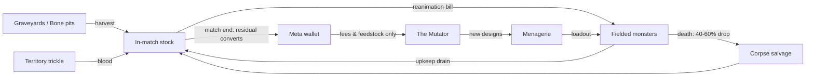

# 05 — The Component Economy

Status: Draft v0.1 · Pillars served: 1, 3 · Terms: [glossary](00-index.md#glossary). All numbers **v0.1 — to be validated in the Phase-1 sandbox**. Citizen-harvest and Repair extensions tracked as Q17, Q18, Q22 in [12-open-questions.md](12-open-questions.md).

## The four components

Components are the *material* currency (mana is the *energy* currency — the dual-currency split is defined in [03-mana-system.md](03-mana-system.md)). Each has a distinct economic identity:

| Component | Identity | Primary sink |
| --- | --- | --- |
| **Blood** | Fast-flowing commodity. Every fielded monster has **upkeep in blood/min**; when your blood reserve hits zero, monsters take decay damage (2% max HP/s) until the books balance. *(Decay rule superseded by [22-economy-system.md](22-economy-system.md)'s per-unit efficiency floors — Q25 tracks the reconciling edit.)* (This upkeep identity generalizes per faction: tech parts burn **Fuel**, alien biotech drinks **Ichor** — see [17-factions.md](17-factions.md), implemented in `packages/genome-core/src/energy.ts`.) | Upkeep; Mutator fees |
| **Bones** | Structure. Cost scales with Vitality, Armor, and size. The bulk material. | Reanimation bills |
| **Body Parts** | Capability. Each genome part slot carries a part cost by family/size; the *same items* are Mutator feedstock ([06-mutator-design.md](06-mutator-design.md)) — spend an arm building, or spend it mutating. | Reanimation bills; Mutate bias; Graft |
| **Brains** | Rare prestige resource, one per monster. Quality (Dim/Average/Gifted/Mastermind) gates the genome's stat budget — see the **brain budget** ([06](06-mutator-design.md)). Also harvested in a distinct bulk form, from Citizens and vanquished foes — see below. | Reanimation (consumed; recoverable on salvage at 50%) |

## Faction equivalence (the class × flavor matrix)

The four components above are the **MadDr flavor column** of a three-class
system shared by all factions — Structure (Bone/Steel/Chitin), Motive
(Muscle/Motors/Sinew), Control (Brain/Tubes/Ganglion), with Energy
(Blood/Fuel/Ichor) already adopted. "Body Parts" remain concrete cross-faction
items; **Muscle** is the fungible motive-class material that prices limb mass
in reanimation bills. The full matrix, bill-of-materials formulas, salvage
flavor rules, and the Earth world-source node table live in
[17-factions.md](17-factions.md#materials-the-class--flavor-matrix).
Service note: today's wallet holds `{blood, bones}`; the widened per-flavor
wallet ships with the Postgres store (Phase 2).

## Sources (in match)

**Your army is your economy.** There are no worker units — monsters themselves harvest (a 3-second channel per haul). A deliberate mobile-first simplification: every unit you build can fight *and* gather, so there's no worker-micro tax, and committing your army to a harvest is itself a positional decision.

| Source | Yields | Notes |
| --- | --- | --- |
| **Graveyards** | Body Parts, Brains (slow) | Contestable nodes between the Vats ([02-gameplay-overview.md](02-gameplay-overview.md)); deplete and slowly regrow |
| **Bone pits** | Bones | As above |
| **Territory trickle** | Blood | Each controlled hex ticks +0.1 blood/min — territory *is* the blood supply |
| **Corpse salvage** | 40–60% of the dead monster's bill | From [04-combat-model.md](04-combat-model.md); works on enemy corpses too — paid in the **corpse's own material flavors** ([17](17-factions.md)) |
| **Earth world-sources** | Faction-flavored materials (hospitals, junkyards, farms…) | Node table + asymmetric valuation in [17](17-factions.md#world-sources-on-earth) |
| **Collection Stations** | Blood, Bones, Brains (small, flat, per-citizen) | Only from Citizen deaths inside a *captured* station's radius, on a city battlefield ([18-city-battlefields.md](18-city-battlefields.md), [19-citizens.md](19-citizens.md)); full mechanic in [20-harvest-and-repair.md](20-harvest-and-repair.md) |
| **Cannibalize** | Bones, Body Parts, a Brain-tier roll (50% of the source's own build cost) | *In match*: recall and dismantle one of your own living creatures at the Vat. The design/Notebook equivalent — retiring an owned genome at the Workshop between matches — is the same formula but a meta-wallet, not an in-match, source ([06-mutator-design.md](06-mutator-design.md), [20](20-harvest-and-repair.md)) |

### Brains, the bulk resource — the same word, a different scale

Citizens ([19](19-citizens.md)) and vanquished foes ([20](20-harvest-and-repair.md)) are now a resource source, harvested via Collection Stations (above) and corpse salvage. Per the creator's own naming direction, this shares its name with the discrete Brains component above rather than being coined as a separate term — but it is **additive**, not a reinterpretation: harvested **Brains**, plural, does *not* satisfy the discrete, one-per-monster brain-tier-item requirement above — a Mastermind still needs one actual tier-quality Brain to be built at all, and no quantity of harvested Brains substitutes for it.

Read it as two senses of one word, the way a butcher's "brains" (a cut, sold by the pound) and "a brain" (the organ, one to a skull) are the same word at different scales. The tier-item is the organ — singular, precious, gates what a creature can be. Harvested Brains are the cut — bulk, common, individually weak, with exactly one sink: the **Megabrain Augmentation** ([06-mutator-design.md](06-mutator-design.md), [16-brains-behavior-command.md](16-brains-behavior-command.md)).

Bones and Blood don't get a parallel bulk sub-resource of their own: they're already bulk/quantity currencies, so a citizen kill just adds a small amount of the *same* currency — no meaning to dilute. The discrete Brain tier-item has no such bulk form until now, so this is genuinely new, not a rename of existing behavior.

**Player-facing vs. internal naming.** Everything above — the HUD, the Lab, this doc's prose — is what the player reads, and it says "Brains" throughout, per creator direction. That's a presentation-layer decision, not a schema mandate: internally (wallet field names, code, engineering shorthand), this resource is free to keep its working development name, **`greyMatter`**, distinct from the genome's `brainQuality` field. Two names, one player-facing word — the split exists so engineers never have to say "which Brains" in code or commit messages, while the player only ever sees the one word.

**Per-citizen yield table (v0.1):**

| Yield | Amount |
| --- | --- |
| Blood | 2 |
| Bones | 1 |
| Brains | 1 |

Blood has never dropped from monster corpse salvage before now (the existing 40–60% salvage rule only ever covered Bones/Parts/Brain — Blood is upkeep tempo, not a stored component). Citizen Blood yield is a genuinely new source type, not a change to the salvage rule above.

**Worked example — "vanquished foes have more resources than humans," made falsifiable:** Shambler bill 20 Bones, salvaged at the 50% midpoint = **10 Bones** — the same as **10 average citizens** harvested through a Collection Station (1 Bone each). Stitched Brute bill 60 Bones → 30 Bones salvaged = **30 citizens' worth**. The comparison actually understates it: a monster kill also drops Body Parts and a chance at a tier Brain — resource classes no number of citizens ever yields. Vanquished *faction* foes (Human Army, Alien Hive) go further still, dropping harvestable Body Parts of their own origin usable in hybrid grafting — the full story, including why Human wrecks are just as valid a target as Alien ones, is in [20](20-harvest-and-repair.md)'s harvest section. Vanquished foes are richer in volume, kind, *and* origin.

## Reanimation

Fielding a Menagerie design at the Vat costs:

```
component bill (bones + parts + brain)  +  mana surge (03)  +  reanimation time (5–20 s by brain quality, 06)
```

### Sample cost table — three archetype monsters

| | **Shambler** (starter biped) | **Stitched Brute** (hulking) | **Winged Horror** (winged) |
| --- | --- | --- | --- |
| Bones | 20 | 60 | 25 |
| Body Parts | 4 | 8 | 6 |
| Brain | Dim | Average | Gifted |
| Mana surge | 15 | 35 | 30 |
| Reanimation time | 5 s | 10 s | 15 s |
| Blood upkeep | 10 /min | 25 /min | 18 /min |
| Indicative stats | Vit 150 / Pow 12 | Vit 320 / Pow 28 / slow | Vit 120 / Pow 18 / fast, flies over ridge hexes |

These three are the sandbox's seed roster and the FTUE monsters ([02](02-gameplay-overview.md)).

### Repair — a second Vat sink

A damaged-but-living creature can be healed at the Vat for a resource cost, proportional to missing HP — full mechanic and formula in [20-harvest-and-repair.md](20-harvest-and-repair.md). Stated here because it's a real sink, not a detail: Repair costs **Bone + Blood only — never Parts, Brain, or mana surge.** Deliberate boundary: Repair patches a frame back to what it already was, it never grants new capability, so it can't be used to dodge the brain-tier gate or any other construction cost above.

## Flows



## Anti-snowball mechanisms

Three interlocking brakes, so a won fight doesn't end the match at minute four:

1. **Upkeep**: a big army bleeds blood; the winner who over-builds starves unless they also hold territory (the trickle), pulling them forward into contestable space.
2. **Corpse salvage symmetry**: the loser of a fight *on home turf* loots the corpses nearer their Vat first and recoups 40–60% of their losses; the winner must push into salvage range to deny it ([04](04-combat-model.md)).
3. **Capture pause**: contested emitter captures freeze, so a map-sweep still takes real time ([03](03-mana-system.md)), giving the defender a reanimation window.

## Meta economy (between matches)

- Match rewards (v0.1): **win** = 100 blood / 40 bones / 6 parts / 1 brain-roll (70% Dim, 25% Average, 5% Gifted); **loss** = 60 / 25 / 4 / brain-roll at half odds. Losses must stay worth playing — the Mutator loop is the consolation engine ([02](02-gameplay-overview.md)).
- Residual in-match stock converts to meta wallet at 25% (so hoarding in-match is bad play, but not punished to zero). Whether harvested Brains follows this same rate, or a bespoke one given it's single-purpose feedstock for one Mutator op, is open — **Q17**.
- **The fairness rule (load-bearing, cites pillar — [01-vision.md](01-vision.md))**: *meta components are spent only in the Mutator — fees, feedstock, grafts. They never buy in-match resources, boosts, or reanimations.* Match power comes only from what you harvest in the match and the quality of designs you bring. This is the wall that keeps the Mutator economy from becoming pay-to-win plumbing, whatever monetization becomes ([12-open-questions.md](12-open-questions.md)).

## v0.1 tuning table (consolidated)

| Knob | Value |
| --- | --- |
| Harvest channel | 3 s per haul |
| Territory blood trickle | 0.1 blood/min per hex |
| Decay damage at blood-zero | 2% max HP/s |
| Salvage drop / window / channel | 40–60% / 15 s / 3 s |
| Brain salvage recovery | 50% |
| Match-end stock conversion | 25% |
| Win / loss rewards | above |
| Per-citizen yield (Blood / Bones / Brains) | 2 / 1 / 1 |
| Bones cost formula | `4×sizeClass + 0.1×Vitality + 2×Armor` ([06](06-mutator-design.md)) |
| Repair cost | Bone/Blood proportional to missing HP ([20](20-harvest-and-repair.md)) |
