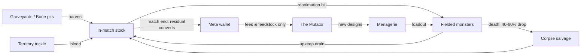

# 05 — The Component Economy

Status: Draft v0.1 · Pillars served: 1, 3 · Terms: [glossary](00-index.md#glossary). All numbers **v0.1 — to be validated in the Phase-1 sandbox**.

## The four components

Components are the *material* currency (mana is the *energy* currency — the dual-currency split is defined in [03-mana-system.md](03-mana-system.md)). Each has a distinct economic identity:

| Component | Identity | Primary sink |
| --- | --- | --- |
| **Blood** | Fast-flowing commodity. Every fielded monster has **upkeep in blood/min**; when your blood reserve hits zero, monsters take decay damage (2% max HP/s) until the books balance. (This upkeep identity generalizes per faction: tech parts burn **Fuel**, alien biotech drinks **Ichor** — see [17-factions.md](17-factions.md), implemented in `packages/genome-core/src/energy.ts`.) | Upkeep; Mutator fees |
| **Bones** | Structure. Cost scales with Vitality, Armor, and size. The bulk material. | Reanimation bills |
| **Body Parts** | Capability. Each genome part slot carries a part cost by family/size; the *same items* are Mutator feedstock ([06-mutator-design.md](06-mutator-design.md)) — spend an arm building, or spend it mutating. | Reanimation bills; Mutate bias; Graft |
| **Brains** | Rare prestige resource, one per monster. Quality (Dim/Average/Gifted/Mastermind) gates the genome's stat budget — see the **brain budget** ([06](06-mutator-design.md)). | Reanimation (consumed; recoverable on salvage at 50%) |

## Sources (in match)

**Your army is your economy.** There are no worker units — monsters themselves harvest (a 3-second channel per haul). A deliberate mobile-first simplification: every unit you build can fight *and* gather, so there's no worker-micro tax, and committing your army to a harvest is itself a positional decision.

| Source | Yields | Notes |
| --- | --- | --- |
| **Graveyards** | Body Parts, Brains (slow) | Contestable nodes between the Vats ([02-gameplay-overview.md](02-gameplay-overview.md)); deplete and slowly regrow |
| **Bone pits** | Bones | As above |
| **Territory trickle** | Blood | Each controlled hex ticks +0.1 blood/min — territory *is* the blood supply |
| **Corpse salvage** | 40–60% of the dead monster's bill | From [04-combat-model.md](04-combat-model.md); works on enemy corpses too |

## Reanimation

Fielding a Menagerie design at the Vat costs:

```
component bill (bones + parts + brain)  +  mana surge (03)  +  reanimation time (5–20 s by brain quality, 06)
```

### Sample cost table — three archetype monsters

| | **Shambler** (starter biped) | **Stitched Brute** (hulking) | **Winged Horror** (winged) |
| --- | --- | --- | --- |
| Bones | 20 | 60 | 25 |
| Body Parts | 4 | 8 | 6 |
| Brain | Dim | Average | Gifted |
| Mana surge | 15 | 35 | 30 |
| Reanimation time | 5 s | 10 s | 15 s |
| Blood upkeep | 10 /min | 25 /min | 18 /min |
| Indicative stats | Vit 150 / Pow 12 | Vit 320 / Pow 28 / slow | Vit 120 / Pow 18 / fast, flies over ridge hexes |

These three are the sandbox's seed roster and the FTUE monsters ([02](02-gameplay-overview.md)).

## Flows



## Anti-snowball mechanisms

Three interlocking brakes, so a won fight doesn't end the match at minute four:

1. **Upkeep**: a big army bleeds blood; the winner who over-builds starves unless they also hold territory (the trickle), pulling them forward into contestable space.
2. **Corpse salvage symmetry**: the loser of a fight *on home turf* loots the corpses nearer their Vat first and recoups 40–60% of their losses; the winner must push into salvage range to deny it ([04](04-combat-model.md)).
3. **Capture pause**: contested emitter captures freeze, so a map-sweep still takes real time ([03](03-mana-system.md)), giving the defender a reanimation window.

## Meta economy (between matches)

- Match rewards (v0.1): **win** = 100 blood / 40 bones / 6 parts / 1 brain-roll (70% Dim, 25% Average, 5% Gifted); **loss** = 60 / 25 / 4 / brain-roll at half odds. Losses must stay worth playing — the Mutator loop is the consolation engine ([02](02-gameplay-overview.md)).
- Residual in-match stock converts to meta wallet at 25% (so hoarding in-match is bad play, but not punished to zero).
- **The fairness rule (load-bearing, cites pillar — [01-vision.md](01-vision.md))**: *meta components are spent only in the Mutator — fees, feedstock, grafts. They never buy in-match resources, boosts, or reanimations.* Match power comes only from what you harvest in the match and the quality of designs you bring. This is the wall that keeps the Mutator economy from becoming pay-to-win plumbing, whatever monetization becomes ([12-open-questions.md](12-open-questions.md)).

## v0.1 tuning table (consolidated)

| Knob | Value |
| --- | --- |
| Harvest channel | 3 s per haul |
| Territory blood trickle | 0.1 blood/min per hex |
| Decay damage at blood-zero | 2% max HP/s |
| Salvage drop / window / channel | 40–60% / 15 s / 3 s |
| Brain salvage recovery | 50% |
| Match-end stock conversion | 25% |
| Win / loss rewards | above |
