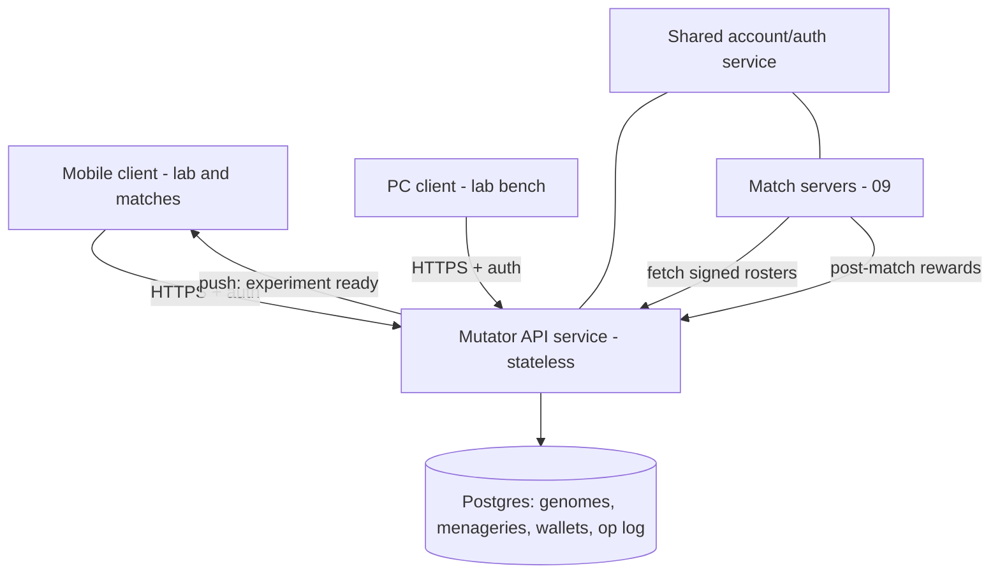

# 07 — Mutator Service Architecture

Status: Draft v0.1 · Pillars served: 1, 4 · Implements the normative genome schema and operators from [06-mutator-design.md](06-mutator-design.md).

> **Implementation:** a first slice of this architecture is built in [`packages/mutator-service`](../packages/mutator-service/) — the REST surface, idempotency, server-seeded RNG, genome signing, the component economy, and the surgery (harvest/sew) endpoints, over a pluggable `Store` (in-memory today; Postgres maps directly onto the data model below). All mutation math comes from [`packages/genome-core`](../packages/genome-core/).

## Why a server

1. **Cross-device consistency** (pillar 4): the lab state lives server-side, so phone and PC are two windows onto one laboratory — no sync conflicts to invent, nothing to merge.
2. **Anti-cheat authority**: genomes decide match power; if clients could write genomes, the game is over. All mutation math runs server-side; clients submit requests, receive results ([06](06-mutator-design.md), [09](09-multiplayer-architecture.md)).
3. **GA compute & evolution of the GA itself**: operator tuning (mutation rates, splice odds) is server config — rebalanceable without client updates.

## System context

The Mutator service and the match servers ([09-multiplayer-architecture.md](09-multiplayer-architecture.md)) are **separate services sharing only the account/auth system**. The lab must stay up when matches are down and vice versa; their scaling shapes are completely different (read-mostly CRUD vs. real-time sim).

## Data model

| Table | Key fields | Notes |
| --- | --- | --- |
| `Account` | id, auth identity, devices | Shared with match side |
| `CreatureGenome` | id, accountId, **genome blob (schema per 06)**, `parentIds[]`, genomeVersion, createdAt, **signature** | **Immutable rows** — every operation creates a *new* genome; nothing is ever edited |
| `Menagerie` | accountId, orderedCreatureIds (≤12), updatedAt | The active loadout ([02-gameplay-overview.md](02-gameplay-overview.md)) |
| `ComponentWallet` | accountId, blood, bones, parts (by familyId), brains (by quality) | Meta currency ([05-component-economy.md](05-component-economy.md)) |
| `OperationLog` | id, accountId, op type, inputs, idempotencyKey, result genomeId, serverSeed, status | Append-only; the audit trail |

**Why immutable genomes + `parentIds` lineage**: family trees and pedigree UI for free ([06](06-mutator-design.md) bench mode), rollback/restore is a pointer change, future genome *sharing/trading* ([12-open-questions.md](12-open-questions.md)) needs no schema change, and signed immutable rows are what match servers can trust. Genomes are tiny, so keeping every ancestor forever is cheap (arithmetic below).

## API surface (first draft — REST + JSON)

| Endpoint | Purpose |
| --- | --- |
| `POST /mutate` | body: `{parentId, fedComponents[], idempotencyKey}` → new genome (or failed-experiment result) |
| `POST /splice` | `{parentAId, parentBId, fedComponents[], idempotencyKey}` → new genome / failed experiment |
| `POST /graft` | `{parentId, slot, partFamilyId, sizeGene, variantGene, idempotencyKey}` → new genome (deterministic) |
| `GET /creatures?cursor=` | Paged collection |
| `GET /creature/{id}` / `GET /creature/{id}/lineage` | Single genome / ancestor tree |
| `GET /menagerie` / `PUT /menagerie` | Read / set the ≤12 loadout |
| `GET /wallet` | Component balances |
| `GET /catalog` | Discovered part families ([06](06-mutator-design.md) discovery) |
| Internal: `GET /roster/{accountId}` (match servers) | Signed Menagerie genomes for the match handshake ([09](09-multiplayer-architecture.md)) |
| Internal: `POST /rewards` (match servers) | Post-match wallet credits ([05](05-component-economy.md)) |

**Idempotency keys are mandatory on every mutating call.** Mobile networks retry; without idempotency a retried `POST /mutate` double-spends components and mints a sibling. The `OperationLog` enforces exactly-once by key.

**Server-seeded randomness**: each operation's RNG seed is generated and logged server-side (`serverSeed` in `OperationLog`) — results are auditable and replayable, and clients can't reroll by resubmitting (the idempotency key returns the *same* result).

## Sync & offline strategy

- The lab is **read-mostly**: simple request/response + an updated-at poll on app focus, plus push notifications ("your experiment is ready"). **Explicitly rejected**: real-time sync frameworks / CRDTs — there is no concurrent-edit problem when all writes are server-executed operations; last-write-wins on the one writable object (`Menagerie`, server-timestamped) is sufficient.
- **Commute mode (the headline cross-device story)**: the mobile client queues operation requests while offline (subway). On connectivity, the queue submits in order with its pre-generated idempotency keys. UX handshake: queued ops show as "experiments in progress" pages in the Notebook; results land as push notifications; walk in the door, open the PC bench, and the new horrors are waiting. No client-side genome math is ever needed for queuing — the queue stores only *requests*.

## Auth & accounts

Standard OAuth/OIDC (Sign in with Apple/Google + email) issuing JWTs honored by both the Mutator API and matchmaking ([09](09-multiplayer-architecture.md)). Device list per account; genome signatures are an HMAC/asymmetric signature by the Mutator service key, verified by match servers — clients never hold signing keys.

## Scaling & cost posture

Genomes are ~200–400 B ([06](06-mutator-design.md)). Worst-case arithmetic: **1M players × 200 genomes × 400 B ≈ 80 GB** — a single modest Postgres instance's working set; lab traffic is a few requests per player-session. This service is *deliberately boring*: managed Postgres + a stateless horizontally-scaled API tier + a push provider. All real scaling pressure lives on the match side ([09](09-multiplayer-architecture.md)).

## Stack recommendation

Managed Postgres + a small stateless API service. Language: **Node/TypeScript or Go** (team-familiarity call, parked in [12-open-questions.md](12-open-questions.md)); nothing here needs the game engine — the genome operators are pure data transforms, implemented once, property-tested against the schema in [06](06-mutator-design.md). The Phase-1 Mutator slice ([11-roadmap.md](11-roadmap.md)) builds `POST /mutate` + Postgres end-to-end as the proving ground.
